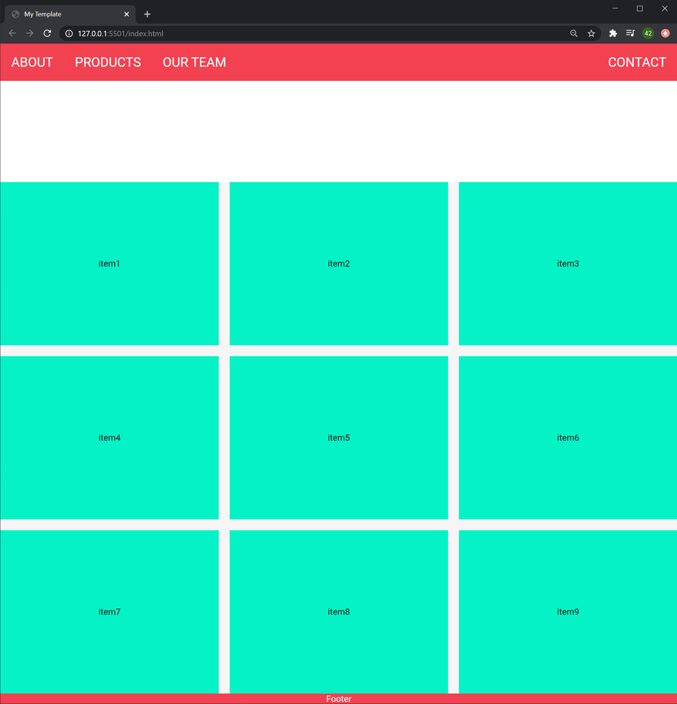

# My Web Site Template

this is part of Udemy Web Development Course by Andrei Neagoie: https://www.udemy.com/course/the-complete-web-developer-zero-to-mastery/



---

## Each Components

### Navigation bar

functions;

- responsive -> use media query
- stick to the top -> create custom CSS class


html
``` html
<body>
    <nav class="zone green">
      <ul class="main-nav">
        <li><a href="">About</a></li>
        <li><a href="">Products</a></li>
        <li><a href="">Our Team</a></li>
        <!-- to put at the end of the page with css -->
        <li class="push"><a href="">Contact</a></li>
      </ul>
    </nav>
...
```
- `nav` tag is not different from `div` regarding to the function, but allows screen readers recognize its function


CSS

```css
/* NAV */
.nav-background {
    background: var(--main-color);
}

.main-nav {
    padding: 0;
    margin: 0;
    display: flex;
    /* to remove bullet of li */
    list-style: none;
    font-size: 1.5em;
}

@media only screen and (max-width: 600px) {
    .main-nav {
        font-size: 1em;
    }
}


li {
    padding: 20px;
}

.push-right {
    margin-left: auto;
}

a {
    color: white;
    /* Remove underline of <a> */
    text-decoration: none;
}

nav {
    text-transform: uppercase;
}
```

Points;

- `.push` > `margin-left: auto` takes as match space (responsive as window size change) as it can to push the item at the right edge of the window.
- `body` usually has pre defined margin, which could be problem when creating nav which covers the entire top region of the screen
- `display: flex` activate flex layout system
  - CSS flex cheat sheet: https://css-tricks.com/snippets/css/a-guide-to-flexbox/


#### make nav stick at the top of the screen 


html

```html
<nav class="sticky">
```

- just add class to be referenced from CSS


CSS

```css
.sticky {
  position: fixed;
  top: 0;
  width: 100%;
}
```

- when ever the size is not good, try adjusting width or height!


## Cover (centered item of the screen)


> for text or images which should be displayed at the center of the page, use this techniques!


html

```html
<!-- COVER -->
    <div class="cover-container">
        COVER!!!
    </div>
```

- add `container` class to reference from CSS


CSS

```css
/* COVER */
.cover-container {
    background-color: white;
    height: 50vh;
    display: flex;
    /* Cross axis alignment */
    align-items: center;
    /* Main axis alignment */
    justify-content: center;
}
```

- using `display flex`
  - `justify-content`: main axis alignment
  - `align-items`: cross axis alignment
  - `height: 50vh` for responsive layout


### Grid 

html

```html
 <!-- GRID ITEMS -->
    <div class="grid-wrapper">
        <div class="grid-item">item1</div>
        <div class="grid-item">item2</div>
        <div class="grid-item">item3</div>
        <div class="grid-item">item4</div>
        <div class="grid-item">item5</div>
        <div class="grid-item">item6</div>
        <div class="grid-item">item7</div>
        <div class="grid-item">item8</div>
        <div class="grid-item">item9</div>
    </div>
```

- wrap each item with `div` which should have class (`grid-wrapper`) to reference from CSS


CSS

```css
/* GRID */
.grid-wrapper {
  display: grid;
  gap: 20px;
  grid-template-columns: repeat(auto-fill, minmax(350px, 1fr));
}
```

- CSS grid cheat sheet: https://css-tricks.com/snippets/css/complete-guide-grid/
- use `grid-template` . it's much simpler!!!


### footer

html

```html
<!-- FOOTER -->
    <footer>Footer</footer>
```


CSS

```css
/* FOOTER */
footer {
  text-align: center;
}
```
